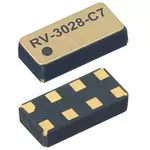

RTC RV-3028-C7 Arduino Library
========================================

[*Application Manual*](https://www.microcrystal.com/fileadmin/Media/Products/RTC/App.Manual/RV-3028-C7_App-Manual.pdf)

The RV-3028-C7 is an extremely precise, extremely low power, highly configurable RTC. Under ideal conditions it runs at approximately 40nA with +/-5ppm per year of deviation (+/- 160 seconds worst case per year).
This library was originally forked from the [Sparkfun RV-1805 library](https://github.com/sparkfun/SparkFun_RV-1805_Arduino_Library), and costumized and enhanced to the RV-3028-C7.

This library allows the user to:

* Set time using hard numbers or the BUILD_TIME from the Arduino compiler
* Read time
* Configure various aspects of the RTC including setting of alarms, countdown timers, periodic time update, trickle charging and power switchover mode.

Examples are included to get you started (but still missing for CountdownTimer and PeriodicTimeUpdate Interrupt).

Repository Contents
-------------------

* **/examples** - Example sketches for the library (.ino). Run these from the Arduino IDE. 
* **/src** - Source files for the library (.cpp, .h).
* **keywords.txt** - Keywords from this library that will be highlighted in the Arduino IDE. 
* **library.properties** - General library properties for the Arduino package manager. 

Documentation
--------------
The library enables the following functions:

### General functions
Please call begin() sometime after initializing the I2C interface with Wire.begin().
###### `begin()`
###### `is12Hour()`
###### `isPM()`
###### `set12Hour()`
###### `set24Hour()`

### Interrupt status
###### `status()`
###### `clearInterrupts()`

### Set Time functions
###### `setTime(sec, min, hour, weekday, date, month, year);`
###### `setSeconds(value)`
###### `setMinutes(value)`
###### `setHours(value)`
###### `setWeekday(value)`
###### `setDate(value)`
###### `setMonth(value)`
###### `setYear(value)`
###### `setToCompilerTime()`

### Get Time functions
Please call "updateTime()" before calling one of the other getTime functions.
###### `updateTime()`
###### `getSeconds()`
###### `getMinutes()`
###### `getHours()`
###### `getWeekday()`
###### `getDate()`
###### `getMonth()`
###### `getYear()`
###### `stringDateUSA()`
###### `stringDate()`
###### `stringTime()`
###### `stringTimeStamp()`

### UNIX Time functions
Attention: UNIX Time and real time are INDEPENDENT!
###### `setUNIX(value)`
###### `getUNIX()`

### Alarm Interrupt functions
###### `enableAlarmInterrupt(min, hour, date_or_weekday, bool setWeekdayAlarm_not_Date, mode)`
###### `disableAlarmInterrupt()`
###### `readAlarmInterruptFlag()`
###### `clearAlarmInterruptFlag()`
Set the alarm mode in the following way:  
0: When minutes, hours and weekday/date match (once per weekday/date)  
1: When hours and weekday/date match (once per weekday/date)  
2: When minutes and weekday/date match (once per hour per weekday/date)  
3: When weekday/date match (once per weekday/date)  
4: When hours and minutes match (once per day)  
5: When hours match (once per day)  
6: When minutes match (once per hour)  
7: All disabled – Default value  
If you want to set a weekday alarm (setWeekdayAlarm_not_Date = true), set _date_or_weekday_ from 0 (Sunday) to 6 (Saturday).  
For further information about the alarm mode see [*Application Manual p. 68*](https://www.microcrystal.com/fileadmin/Media/Products/RTC/App.Manual/RV-3028-C7_App-Manual.pdf#page=68).

### Countdown Timer Interrupt functions
Thanks [@JasonEdinburgh](https://github.com/JasonEdinburgh) for this enhancement.
###### `setTimer(bool timer_repeat, uint16_t timer_frequency, uint16_t timer_value, bool setInterrupt, bool start_timer)`
###### `enableTimer()`
###### `disableTimer()`
###### `enableTimerInterrupt()`
###### `disableTimerInterrupt()`
###### `readTimerInterruptFlag()`
###### `clearTimerInterruptFlag()`
_timer_repeat_  specifies either Single or Repeat Mode for the Periodic Countdown Timer.  
Setting of _timer_frequency_:
| _timer_frequency_ |        | error on first time | max. duration (_timer_value = 4095_) |
|:-----------------:|:------:|:-------------------:|:------------------------------------:|
| 4096 (default)    | 4096Hz | 122us               | 0.9998s                              |
| 64                | 64Hz   | 7.813ms             | 63.984s                              |
| 1                 | 1Hz    | 7.813ms             | 4095s                                |
| 60000             | 1/60Hz | 7.813ms             | 4095min                              |
Countdown Period [s] = Timer Value / Timer Frequency  
See [*Application Manual p. 63*](https://www.microcrystal.com/fileadmin/Media/Products/RTC/App.Manual/RV-3028-C7_App-Manual.pdf#page=63) for more information.

### Periodic Time Update Interrupt functions
Thanks [@JasonEdinburgh](https://github.com/JasonEdinburgh) for this enhancement.  
_every_second_ specifies the interrupt to occur either every second or every minute.
###### `setPeriodicUpdate(bool every_second, bool enable_interrupt, bool enable_clock_output)`
###### `disablePeriodicUpdateInterrupt()`
###### `readPeriodicUpdateInterruptFlag()`
###### `clearPeriodicUpdateInterruptFlag()`

### Trickle Charge functions
###### `enableTrickleCharge(uint8_t tcr = TCR_11K)`
###### `disableTrickleCharge()`
At "enableTrickleCharge" you can choose the series resistor:  
TCR_1K for 1kOhm  
TCR_3K for 3kOhm  
TCR_6K for 6kOhm  
TCR_11K for 11kOhm  
See [*Application Manual p. 48*](https://www.microcrystal.com/fileadmin/Media/Products/RTC/App.Manual/RV-3028-C7_App-Manual.pdf#page=48) for more information.

### Backup Switchover Mode
###### `setBackupSwitchoverMode(mode)`
0 = Switchover disabled  
1 = Direct Switching Mode  
2 = Standby Mode  
3 = Level Switching Mode  
See [*Application Manual p. 45*](https://www.microcrystal.com/fileadmin/Media/Products/RTC/App.Manual/RV-3028-C7_App-Manual.pdf#page=45) for more information.

License Information
-------------------

This product is _**open source**_! 

Please review the LICENSE.md file for license information. 

If you have any questions or concerns on licensing, please contact constantinkoch@outlook.com.

Distributed as-is; no warranty is given.
